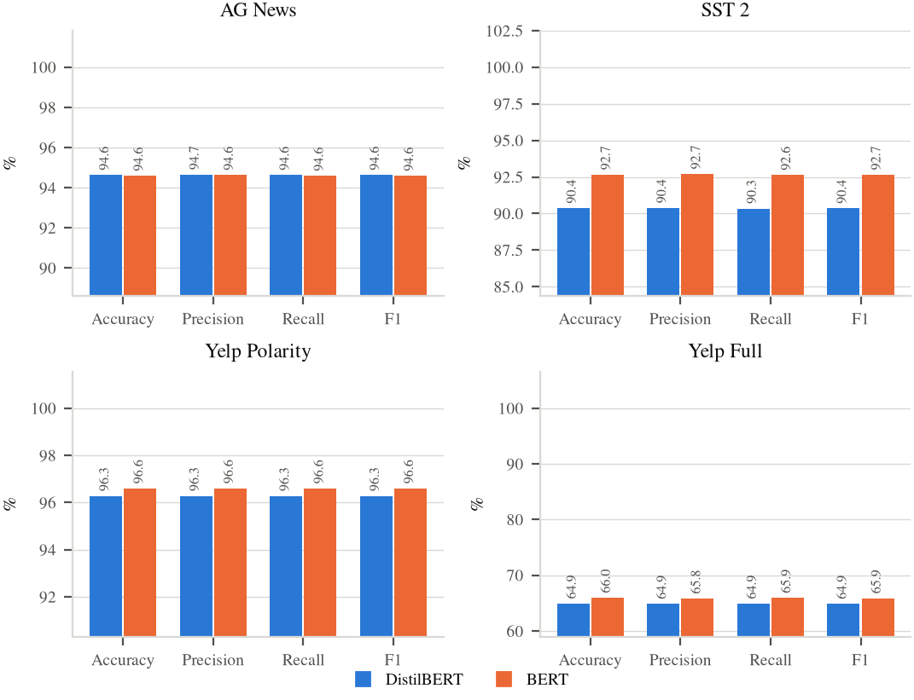
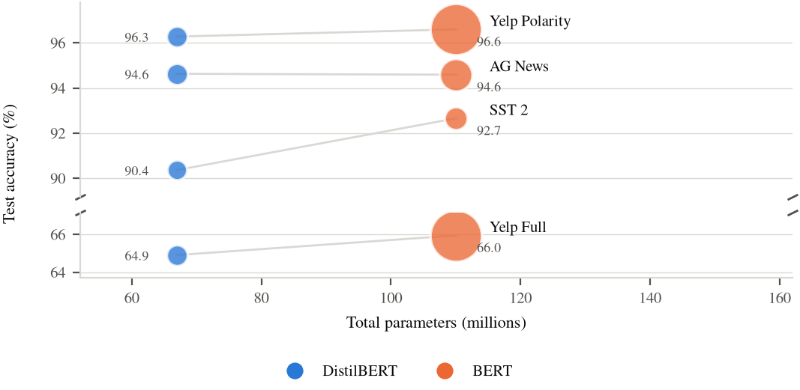
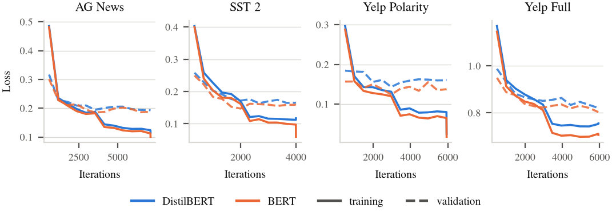
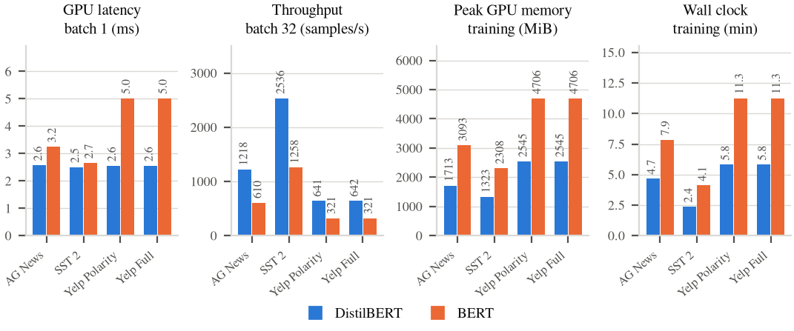
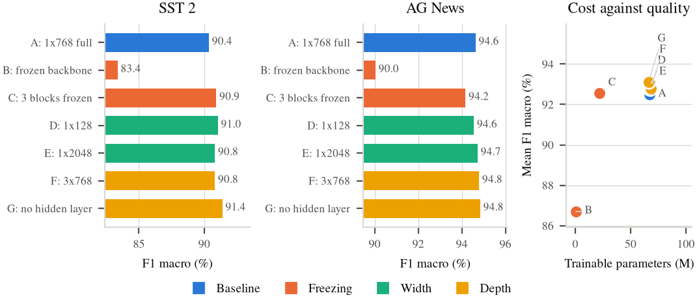
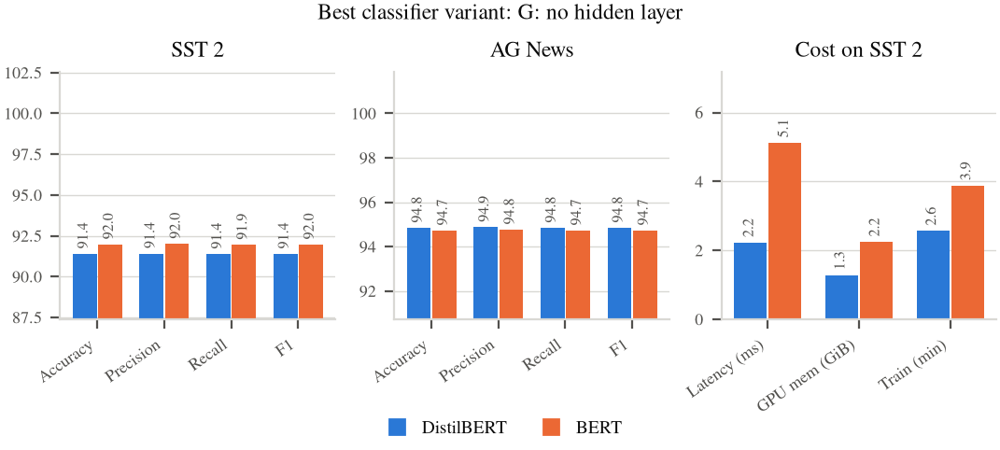
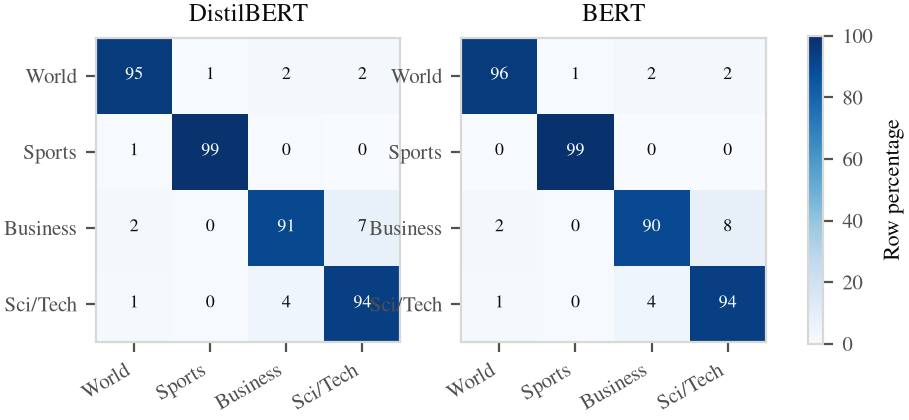
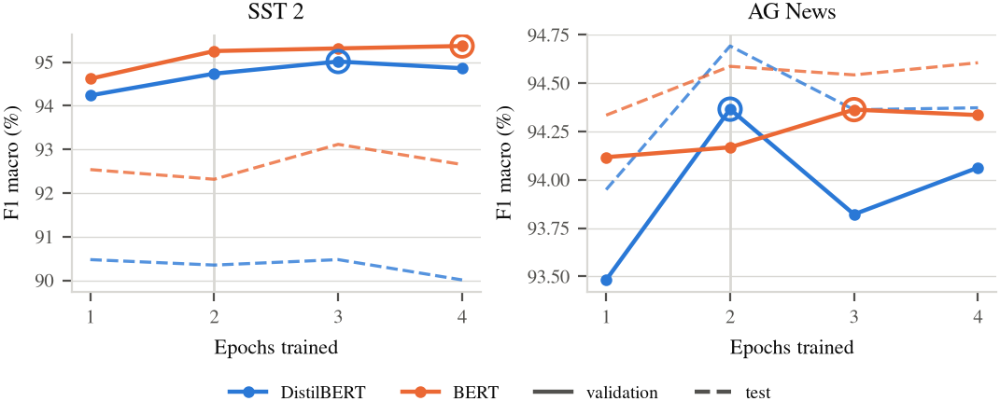
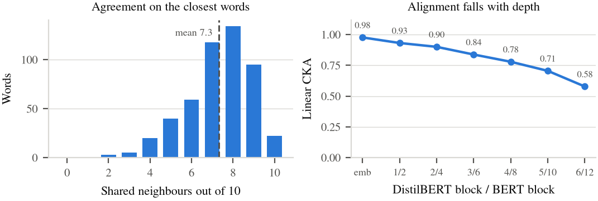

# DistilBERT against BERT for Text Classification

**Project 1, Natural Language Processing, UTEC.** \
Ricardo Amiel Acuña Villogas. \
Juan Leibniz Aquino Espinoza. \
Josué Nehemías Velo Poma.

Fine tuning of DistilBERT and BERT base on four text classification datasets under one controlled
protocol, an ablation over the classifier head, and an interactive tool that compares the two latent
spaces word by word.

Everything reported here is produced by the code in this repository. Each training run writes one JSON
file into artifacts/results, and every figure, table and number in the report is generated from those
files by src/figures.py. No result is transcribed by hand.

## Results summary

Generated by src/figures.py from artifacts/results. Do not edit by hand.

### Performance, identical classifier on both backbones

| Dataset | Model | Accuracy | Precision | Recall | F1 macro |
|---|---|---|---|---|---|
| AG News | DistilBERT | **94.63** | **94.66** | **94.63** | **94.63** |
| AG News | BERT | 94.59 | 94.63 | 94.59 | 94.59 |
| SST 2 | DistilBERT | 90.37 | 90.39 | 90.35 | 90.36 |
| SST 2 | BERT | **92.66** | **92.71** | **92.63** | **92.65** |
| Yelp Polarity | DistilBERT | 96.28 | 96.28 | 96.28 | 96.28 |
| Yelp Polarity | BERT | **96.60** | **96.60** | **96.60** | **96.60** |
| Yelp Full | DistilBERT | 64.91 | 64.86 | 64.89 | 64.86 |
| Yelp Full | BERT | **65.95** | **65.81** | **65.93** | **65.86** |



*Accuracy, precision, recall and F1 for both backbones on every dataset*




*Parameters against accuracy. Bubble area is single example GPU latency*




*Iterations against training loss (solid) and validation loss (dashed)*


### Efficiency, averaged over the datasets

| Measurement | BERT | DistilBERT | DistilBERT advantage |
|---|---|---|---|
| Parameters (M) | 110.1 | **67.0** | 1.64x |
| GPU latency, batch 1 (ms) | 3.99 | **2.55** | 1.57x |
| CPU latency, batch 1 (ms) | 70.3 | **50.1** | 1.40x |
| Throughput, batch 32 (samples/s) | 627 | **1259** | 2.01x |
| Peak GPU memory, training (MiB) | 3703 | **2031** | 1.82x |
| Peak GPU memory, inference (MiB) | 811 | **646** | 1.25x |
| Training wall clock, all datasets (min) | 34 | **19** | 1.85x |



*Latency, throughput, peak training memory and wall clock time*


### Ablation on the classifier, best variant: G: no hidden layer

| Variant | Trainable (M) | SST 2 F1 | AG News F1 |
|---|---|---|---|
| A: 1x768 full | 67.0 | 90.36 | 94.63 |
| B: frozen backbone | 0.6 | 83.37 | 90.04 |
| C: 3 blocks frozen | 21.9 | 90.93 | 94.17 |
| D: 1x128 | 66.5 | 91.05 | 94.55 |
| E: 1x2048 | 67.9 | 90.82 | 94.73 |
| F: 3x768 | 68.1 | 90.82 | 94.79 |
| G: no hidden layer | 66.4 | **91.39** | **94.85** |



*Classifier ablation on DistilBERT. Only the freezing axis separates the variants*


### The best variant with each backbone, every metric

| Metric | SST 2 DistilBERT | SST 2 BERT | AG News DistilBERT | AG News BERT |
|---|---|---|---|---|
| Accuracy (%) | 91.40 | **91.97** | **94.84** | 94.72 |
| Precision, macro (%) | 91.42 | **92.01** | **94.88** | 94.77 |
| Recall, macro (%) | 91.38 | **91.95** | **94.84** | 94.72 |
| F1, macro (%) | 91.39 | **91.97** | **94.85** | 94.73 |
| Test cross entropy | 0.286 | **0.267** | **0.168** | **0.168** |
| Total parameters (M) | **66.4** | 109.5 | **66.4** | 109.5 |
| Trainable parameters (M) | **66.4** | 109.5 | **66.4** | 109.5 |
| GPU latency, batch 1 (ms) | **2.23** | 5.12 | **2.48** | 3.23 |
| CPU latency, batch 1 (ms) | **27.8** | 53.2 | **36.4** | 72.2 |
| Throughput, batch 32 (samples/s) | **2452** | 1218 | **1220** | 611 |
| Peak GPU memory, training (MiB) | **1313** | 2302 | **1706** | 3083 |
| Peak GPU memory, inference (MiB) | **404** | 569 | **539** | 706 |
| Training wall clock (min) | **2.6** | 3.9 | **4.3** | 7.8 |



*The selected classifier variant with each backbone*




*Row normalised confusion matrices on AG News. Both models fail in the same place*


### Epoch study, validation F1 macro after each epoch

| Dataset | Model | 1 | 2 | 3 | 4 | Best |
|---|---|---|---|---|---|---|
| SST 2 | DistilBERT | 94.24 | 94.74 | **95.01** | 94.86 | 3 |
| SST 2 | BERT | 94.62 | 95.25 | 95.31 | **95.37** | 4 |
| AG News | DistilBERT | 93.48 | **94.37** | 93.82 | 94.06 | 2 |
| AG News | BERT | 94.12 | 94.17 | **94.36** | 94.33 | 3 |



*Validation F1 macro at every epoch boundary, dashed lines are the test split*


### Representation alignment between the two pretrained encoders

Neighbour agreement over 496 words: **73.1 percent** of the ten nearest neighbours are shared. Linear CKA of the layer averaged space: **0.8977**.
Topic purity of the ten nearest neighbours: BERT 68.7 percent, DistilBERT 72.2 percent.

| DistilBERT block | BERT block | Linear CKA | Shared neighbours out of 10 |
|---|---|---|---|
| embedding output | embedding output | 0.977 | 8.60 |
| block 1 | block 2 | 0.932 | 7.58 |
| block 2 | block 4 | 0.900 | 6.74 |
| block 3 | block 6 | 0.838 | 5.79 |
| block 4 | block 8 | 0.779 | 5.18 |
| block 5 | block 10 | 0.705 | 4.53 |
| block 6 | block 12 | 0.578 | 3.80 |



*Neighbour agreement between the two encoders, and how alignment falls with depth*


## What is compared

| | BERT base | DistilBERT base |
|---|---|---|
| Transformer blocks | 12 | 6 |
| Hidden size | 768 | 768 |
| Token type embeddings | yes | no |
| Pooler | yes | no |
| Parameters (backbone) | about 109M | about 66M |

DistilBERT is the student of a knowledge distillation procedure that keeps every second block of BERT and
trains against the teacher output distribution, the masked language modelling objective and a cosine
alignment on the hidden states. Depth is the axis that was cut; width, vocabulary and attention are
untouched. This is what makes the comparison interesting: the question is not whether a smaller model is
worse, but how much of the teacher behaviour survived the cut.

## Datasets

| Key | Source | Classes | Train used | Test used | Max length |
|---|---|---|---|---|---|
| ag_news | fancyzhx/ag_news | 4 | 120,000 | 7,600 | 128 |
| sst2 | nyu-mll/glue, config sst2 | 2 | 67,349 | 872 (validation split) | 64 |
| yelp_polarity | fancyzhx/yelp_polarity | 2 | 100,000 | 10,000 | 256 |
| yelp_full | Yelp/yelp_review_full | 5 | 100,000 | 10,000 | 256 |

SST 2 has no public labelled test split, so the validation split is used as the test set, which is the
standard practice for this dataset. The two Yelp datasets are subsampled so that the full set of runs in this
study fits inside one GPU allocation. The study is 26 fine tuning runs in total: 8 for the main
comparison, 12 more for the classifier ablation (two of the seven variants on DistilBERT are already
covered by the main comparison and are reused rather than retrained), 2 for the best variant rebuilt on
BERT, and 4 for the epoch study. Five percent of every training set is held out for the loss curves,
so the test split is never seen during optimisation.

Datasets are never committed. They are downloaded into the Hugging Face cache at run time.

## How the code is organised

```
src/
  config.py             datasets, models, training hyperparameters, the seven ablation variants
  data.py               loading, subsampling, tokenisation, the train and validation and test split
  models.py             backbone plus configurable MLP head, freezing policy, parameter counting
  train.py              the training loop, loss history, peak memory during training
  metrics.py            accuracy, precision, recall, F1, latency benchmark, GPU memory
  experiment.py         one full run, from data to the saved JSON result
  run.py                command line entry point for the five experiment modes
  export_embeddings.py  builds the JSON the interactive demo reads
  figures.py            every figure, every LaTeX table, and the macro file the report uses
  wordlist.py           the 496 word vocabulary used by the demo
notebooks/
  ablation_study.ipynb  the ablation study with evidence, loads artifacts instead of retraining
cluster/
  job_all.sbatch        the SLURM job that runs the four main stages
  job_epochs.sbatch     the epoch study, queued to run after job_all
  prefetch.py           downloads checkpoints and datasets on the login node
  sync_to_khipu.sh      pushes the code to the cluster
  sync_from_khipu.sh    pulls results, logs and demo data back
artifacts/
  results/              one JSON per run, the evidence behind every number
  figures/              every figure as PDF and SVG
  tables/               LaTeX fragments consumed by the report
  logs/                 SLURM output
web/
  index.html            the d3 v7 interactive comparison
  data/                 words.json, sentences.json, summary.json
report/
  main.tex              the four page report, NeurIPS 2025 style
  neurips_2025.sty      the official style file
  refs.bib              references
```

## The classifier, and why both models get the same one

Both backbones are wrapped in one module. The final hidden state of the CLS position is taken and passed
through an MLP with dropout before every linear map. The BERT pooler is deliberately not used, because
DistilBERT does not have one: reading both models in exactly the same way keeps the comparison fair and
makes the head ablation meaningful.

The head exposes the three axes the assignment asks about:

1. **Freezing**: embeddings plus the first n transformer blocks, where n equal to all blocks is a linear probe.
2. **Neurons per classifier layer**: the width of each hidden layer.
3. **Number of classifier layers**: the depth of the head.

The seven variants are defined in src/config.py:

| Key | Head | Frozen | Axis probed |
|---|---|---|---|
| A_baseline | 1 x 768 | none | reference, the default DistilBERT design |
| B_frozen_all | 1 x 768 | all 6 blocks | freezing |
| C_frozen_half | 1 x 768 | first 3 blocks | freezing |
| D_narrow | 1 x 128 | none | neurons per layer |
| E_wide | 1 x 2048 | none | neurons per layer |
| F_deep | 3 x 768 | none | number of layers |
| G_linear | none | none | number of layers |

The best variant is selected by a rule fixed in advance: highest mean macro F1 across the two ablation
datasets. That rule is implemented in src/run.py, not applied after looking at the numbers.

## How many epochs, and why

Every run uses 2 epochs. That is not a guess. The BERT paper states its fine tuning recommendation in
Appendix A.3:

> we found the following range of possible values to work well across all tasks: Batch size: 16, 32 ;
> Learning rate (Adam): 5e-5, 3e-5, 2e-5 ; Number of epochs: 2, 3, 4

Our configuration sits inside that grid: batch 32, learning rate 2e-5 on the backbone, 2 epochs. The same
appendix adds that "large data sets (e.g., 100k+ labeled training examples) were far less sensitive to
hyperparameter choice than small data sets", and three of our four datasets are at or above that size.
DistilBERT does not state an epoch count of its own and inherits the BERT recipe.

We then test the choice instead of trusting it. The epoch study trains both backbones on SST 2 and AG News
to 4 epochs, the top of the recommended range, scores the full validation split at every epoch boundary and
selects the best epoch by validation macro F1:

```bash
python src/run.py --mode epochs
```

The test split is scored at every boundary too, but only for reporting. Model selection uses validation
alone.

## How the measurements are taken

**Performance.** Accuracy plus macro averaged precision, recall and F1 on the official test split. Macro
averaging so the five class Yelp task is not dominated by its easy classes. Per class scores and the
confusion matrix are stored in each result file as well.

**Latency.** Float32, 20 warmup passes, then the median of 200 timed passes at batch size one with explicit
CUDA synchronisation around each pass. Throughput is measured separately at batch size 32. A single example
CPU latency is also recorded, because that is the setting where the size difference matters most.

**GPU memory.** Peak allocated bytes during the training loop, and peak allocated bytes during a short
inference pass, both read from the CUDA allocator rather than from nvidia-smi, so the number is the memory
the model actually needs and not what the caching allocator happened to reserve.

**Training dynamics.** Training loss and validation loss recorded at twelve equally spaced points across the
run, the validation loss computed on the held out slice.

## Reproducing the results

### Local, one GPU

```bash
python -m venv .venv
.venv/bin/pip install -r requirements.txt
export PYTHONPATH=$PWD/src

python src/run.py --mode main           # both backbones, four datasets
python src/run.py --mode ablation       # seven classifier variants on DistilBERT
python src/run.py --mode best_on_bert   # the winning variant rebuilt on BERT
python src/run.py --mode epochs         # 4 epochs, scored at every epoch boundary
python src/export_embeddings.py         # data for the interactive demo
python src/figures.py                   # every figure, table and report macro
```

A single run can also be launched on its own:

```bash
python src/run.py --mode single --model bert --dataset sst2 --head E_wide
```

Results are cached. A run whose JSON file already exists is skipped, so the pipeline can be interrupted and
resumed. Pass --overwrite to force a rerun.

### On the Khipu cluster

The compute node has no internet access, so the checkpoints and datasets are downloaded first on the login
node and the job then runs offline.

```bash
bash cluster/sync_to_khipu.sh

ssh ricardo.acuna@khipu.utec.edu.pe
module load cuda/12.8 miniconda/3.0
cd nlp-proyecto1
export PYTHONPATH=$PWD/src
$HOME/.conda/envs/nlp-p1/bin/python cluster/prefetch.py
sbatch cluster/job_all.sbatch
squeue -u $USER
```

The job writes to artifacts/logs. To follow it:

```bash
tail -f artifacts/logs/slurm_nlp-p1_<jobid>.out
```

When it finishes, bring everything back:

```bash
bash cluster/sync_from_khipu.sh
python src/figures.py
```

## The interactive comparison

web/index.html is a d3 v7 page that puts the two latent spaces side by side. It has two views.

**Words.** 496 words across 20 topics, each embedded on its own by the two **pretrained** checkpoints, with
the sub token vectors of the final layer averaged. Type a word into the search box and the page shows the
ten closest words according to each model, marks the ones both models agree on, and draws the same
neighbourhood on both scatter plots. Neighbours, the agreement percentage and the CKA are computed in the
full 768 dimensions; the scatter plots are a 2D view of the same vectors, PCA down to 50 then t-SNE down to
2, with the DistilBERT layout rotated onto the BERT layout so the panels can be compared by eye.

The word view uses the pretrained checkpoints on purpose. The claim being tested is what distillation
preserved, which is a property of the distilled checkpoint. Fine tuning first would reshape the space
toward the task and the measurement would then be about our training run instead.

**AG News sentences.** Test sentences embedded by the two encoders **after our fine tuning**, coloured by
their true topic. This is the view that uses our own weights.

**Alignment by depth.** The page also plots how close the two encoders are at matched depths, comparing
student block d against teacher block 2d, the layer it was initialised from. This is where the interesting
result is: the two models are almost the same space at the embeddings and drift apart only at the top.
Fine tuning then reverses that drift. The pretrained top layers sit at CKA 0.578, but after both models are
fine tuned on AG News their sentence representations reach CKA 0.975, so training on a shared task pulls
them back together.

Two details of the word measurement are deliberate and worth knowing. First, the word vector is the mean
over all transformer layers, not the last layer, because the last layer of a pretrained encoder is
specialised for the masked language modelling objective and is a poor place to read word similarity.
Second, the mean over all words is subtracted before any cosine is taken, which removes the well known
anisotropy of BERT vectors. Reading only the last layer without centering drops the neighbour agreement
from about 73 percent to about 38 percent, which measures the anisotropy of the top layer rather than the
similarity of the two models.

The statistics strip and the results table on the page are read from artifacts/results, so the page never
shows a number that was not measured.

Run it with a static server, because the page loads its data with fetch:

```bash
cd web && python -m http.server 8000
```

Then open http://localhost:8000. A view is shareable as a link: ?word=guitar opens that word, and ?view=ag_news opens a dataset panel.

## The report

```bash
cd report
pdflatex main && bibtex main && pdflatex main && pdflatex main
```

The report reads its figures from artifacts/figures and its tables and numeric macros from
artifacts/tables, so it always reflects the current results. Run src/figures.py before compiling.

## Notes

The .gitignore excludes datasets, the Hugging Face cache, fine tuned weights, reference PDFs and LaTeX
build products. What is committed is the code, the per run JSON results, the figures, the demo data and
the report source, which is everything needed to check the work without redownloading anything large.
